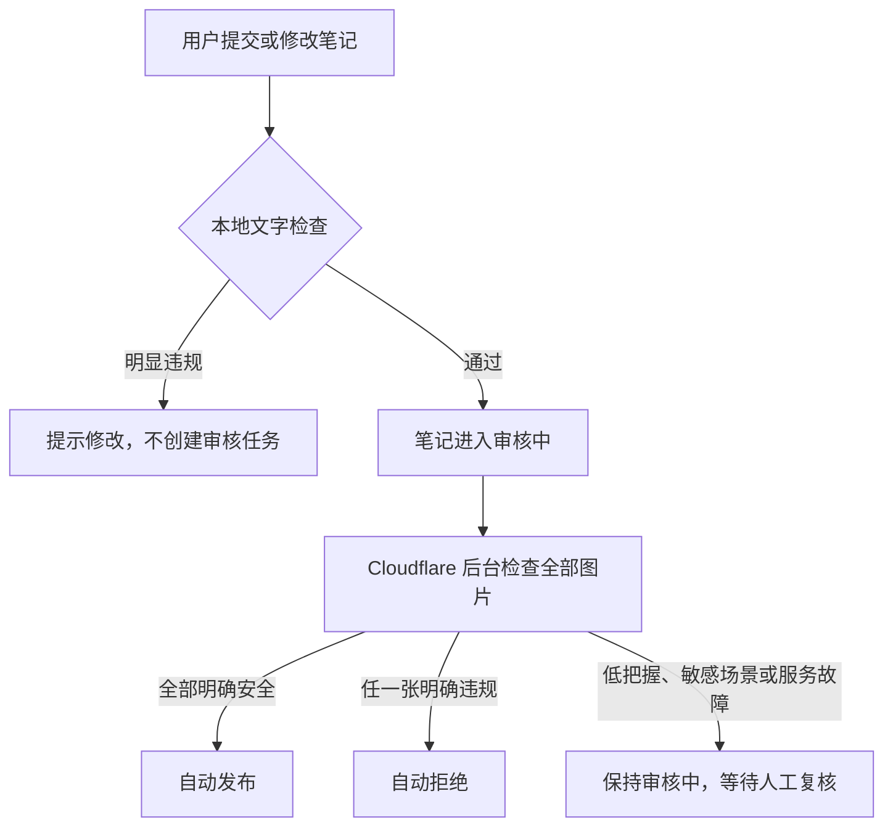

# Youni 图文自动审核第一版

## 交付结论

第一版已经接入现有发布和编辑流程。用户提交笔记后，系统先在本地检查文字，再把图片放到 Cloudflare 后台检查：

- 普通内容自动发布。
- 明显违规的文字立即提示用户修改。
- 明显违规的图片自动拒绝，作者仍可查看并修改。
- 政治人物或公共事件、大段图片文字、二维码或联系方式、隐私证件，以及任何低把握结果，继续留在后台由人工复核。
- 图片检查服务不可用、返回格式异常或后台任务出错时，笔记保持“审核中”，不会误发布。
- 已发布笔记只要编辑内容，就会重新进入审核流程。

这套方案不需要单独准备图片服务器，也没有接入腾讯云。

## 审核流程



作者提交后会看到“已提交审核，通过后会自动发布”的提示。在笔记详情页，作者能看到“正在审核”或“未通过”的状态说明；停留在详情页时状态会自动刷新，审核中的内容仍然只有作者自己能查看。

## 文字检查

文字检查使用 MIT 许可的开源库 [sensitive-word-tool](https://github.com/liuxueyong123/sensitive-word-tool) 在项目服务内部完成，不会为了匹配敏感词调用外部接口。项目没有直接采用库自带的大词表，而是维护一份偏保守的业务词表，减少正常内容被误伤。它覆盖以下用户可见内容：

- 标题和正文
- 话题和位置
- 内容声明
- 投票、附件等附加内容的标题、选项和值

当前词表优先拦截明确的违法交易、色情招揽、赌博推广、诈骗引流、恐怖活动教程和严重辱骂。匹配前会统一全角字符，并能识别用空格、横线和下划线拆开的常见规避写法。

词表有意保持保守，避免把反诈科普、新闻讨论等正常语境直接拒绝。它是第一道快速拦截，不等同于完整的中国大陆内容合规词库，运营侧仍需持续维护词表并处理人工复核内容。

## 图片检查

图片使用 Cloudflare Workers AI 上的 Moondream 3.1 检查。每张图片得到“通过、人工复核、拒绝”三类结果，再合并为整篇笔记的结果。

明确违规类别包括：

- 露骨色情、裸露及未成年人性内容
- 严重血腥伤害和自残
- 枪支、毒品等违法售卖或制作
- 赌博、诈骗招揽
- 恐怖极端宣传

以下情况不会自动通过，而是转人工复核：

- 政治人物、政治符号或公共事件
- 图片中有大量中文文字
- 二维码、联系方式或明显导流信息
- 身份证件、个人资料等隐私内容
- 图片模糊、模型低把握或返回内容不完整

为了降低误判，安全结果把握度达到 0.85 且没有风险类别时才会自动发布，违规结果把握度达到 0.90 时才会自动拒绝，其余全部转人工。多图笔记中，只要有一张明确违规就会拒绝；必须全部明确安全才会发布。

## 安全和故障处理

- 新发布的图片必须来自当前作者自己的上传目录，不能让审核任务读取任意网络地址。
- 编辑旧笔记时，允许继续使用笔记原来已有的图片，兼容历史数据。
- 后台任务会确认笔记仍在审核中，并确认图片列表没有被用户换掉，才会写入结果。旧任务不会覆盖刚刚修改的新图片。
- 图片判断服务异常时直接保留人工复核，不会反复卡住用户请求，也不会把异常当成安全。
- 用户只看到统一的未通过提示，不会暴露具体命中规则，降低针对规则反复试探的风险。
- 数据库写入暂时失败时，后台任务最多自动重试三次；最终即使仍失败，笔记也保持审核中。

## Cloudflare 使用范围

Cloudflare 负责后台任务和图片判断，不需要自建显卡服务器。使用的模型标识为 `@cf/moondream/moondream3.1-9B-A2B`，通过公开的图片地址读取待检查图片。

需要明确的是：

- 图片会交给 Cloudflare 处理，因此图片审核不是完全本地离线方案。
- 当前图片地址可直接访问，只是随机地址很难猜到；第一版尚未做审核前私有访问或短时签名地址。
- 本地开发环境中的图片地址通常不能被 Cloudflare 访问，所以本地端到端检查会保守地停留在人工复核；部署后的公开 HTTPS 地址才具备完整能力。
- Workers AI 按使用量收费，价格可能变化，上线前应查看 Cloudflare 最新价格。

官方资料：

- [Moondream 3.1 模型说明](https://developers.cloudflare.com/workers-ai/models/moondream3.1-9B-A2B/)
- [Cloudflare 发布说明](https://developers.cloudflare.com/changelog/post/2026-07-08-moondream31-workers-ai/)
- [Workers AI 数据使用说明](https://developers.cloudflare.com/workers-ai/platform/data-usage/)
- [Workers AI 价格](https://developers.cloudflare.com/workers-ai/platform/pricing/)
- [Cloudflare 图片内容处理参考架构](https://developers.cloudflare.com/reference-architecture/diagrams/serverless/serverless-image-content-management/)

## 涉及的项目位置

- 文字规则：`packages/api/src/lib/content-moderation.ts`
- 图片判断和审核结果处理：`packages/api/src/lib/note-image-moderation.ts`
- 发布和编辑接入：`packages/api/src/lib/content-notes.ts`
- Cloudflare 后台任务配置：`packages/infra/alchemy.run.ts`
- 后台任务入口：`apps/server/src/index.ts`
- 作者端状态提示：`apps/native/components/create/use-create-composer.ts`、`apps/native/components/notes/note-detail/content.tsx`

## 上线方式

现有 Cloudflare 发布流程会同时创建图片审核队列并绑定图片判断能力，不需要增加新的密钥。项目未在本次工作中自动发布；确认 Cloudflare 账户已开通 Workers AI 后，按项目原有方式执行：

```bash
bun run deploy
```

上线后建议用三组自有测试图片做一次验收：普通风景图应自动发布，明显违规的内部测试样本应拒绝，带密集中文或二维码的图片应留在审核中。不要使用真实违法内容或未经授权的个人证件做测试。

## 已完成验证

- 文字和图片规则自动测试：12 项全部通过。
- 覆盖了普通文字、明确违规短语、拆字规避、反诈科普、图片高低把握、异常返回、服务故障、多图合并和图片归属。
- 全项目类型检查通过。
- 服务端打包通过。
- 移动端正式构建通过。
- 本次修改文件的代码格式检查通过。全项目检查另发现一个原有自动生成文件格式不一致，本次没有改动该文件。

## 第一版仍需关注的边界

1. 这不是法律承诺，也不能替代持续更新的运营规则。中国大陆内容治理范围会变化，需要根据实际误判、漏判和平台规模定期复盘。
2. 图片中的中文识别、谐音、隐喻和时事语境仍是薄弱点，因此相关内容默认转人工。
3. 当前没有保存每张图片的详细判断记录，只保存笔记最终状态；如果以后需要申诉、审计或统计，应增加审核记录。
4. 当前自动拒绝只给通用原因。若希望提高用户修改成功率，可以在不暴露具体词条的前提下增加“文字问题、图片问题、需要补充说明”等粗粒度提示。
5. 当内容量显著上升后，应根据人工复核比例调整词表、图片判断标准和并发量，而不是直接扩大自动拒绝范围。
