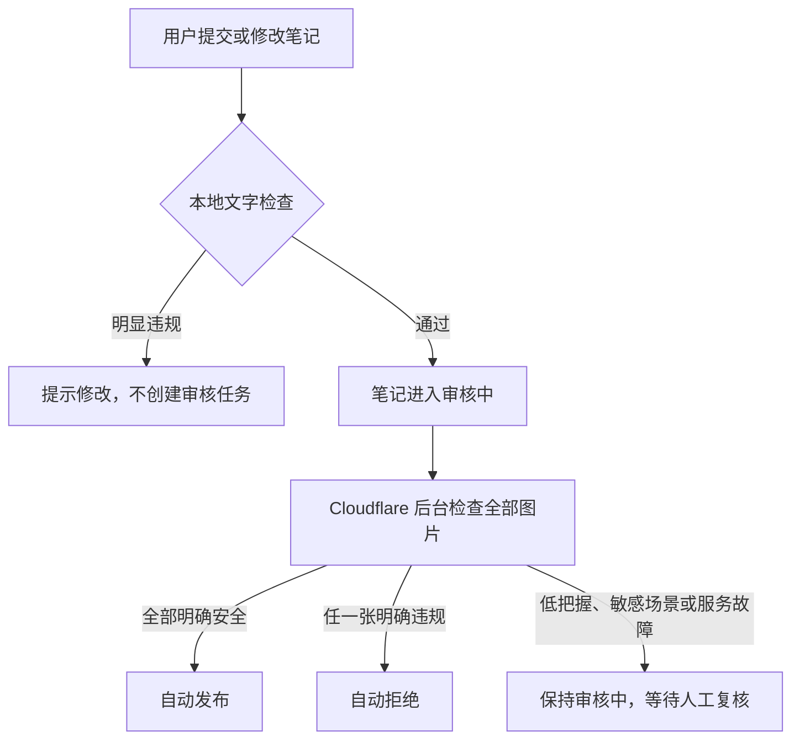

# Youni 图文自动审核第一版

## 交付结论

第一版已经接入现有发布和编辑流程。用户提交笔记后，系统先在本地检查文字，再把图片放到 Cloudflare 后台检查：

- 普通内容自动发布。
- 明显违规的文字立即提示用户修改。
- 明显违规的图片自动拒绝，作者仍可查看并修改。
- 政治人物或公共事件、带导流目的的二维码或联系方式、隐私证件，以及存在具体风险线索但无法确认的结果，继续留在后台由人工复核。
- 图片检查服务不可用、返回格式异常或后台任务出错时，笔记保持“审核中”，不会误发布。
- 已发布笔记只要编辑内容，就会重新进入审核流程。
- 后台提供独立审核队列，可查看自动审核进度、失败原因和每张图片的判断结果，并填写人工拒绝理由。

这套方案不需要单独准备图片服务器，也没有接入腾讯云。

## 审核流程



作者提交后会看到“已提交审核，通过后会自动发布”的提示。在笔记详情页，作者能看到“正在审核”或“未通过”的状态说明；停留在详情页时状态会自动刷新，审核中的内容仍然只有作者自己能查看。

## 文字检查

文字检查使用 MIT 许可的开源库 [sensitive-word-tool](https://github.com/liuxueyong123/sensitive-word-tool) 在项目服务内部完成，不会为了匹配敏感词调用外部接口。项目没有直接采用库自带的大词表，而是维护一份偏保守的业务词表，减少正常内容被误伤。它覆盖以下用户可见内容：

- 标题和正文
- 话题和位置
- 内容声明
- 投票、附件等附加内容的标题、选项和值

当前词表优先拦截明确的违法交易、色情招揽、赌博推广、诈骗引流、恐怖活动教程和严重辱骂。匹配前会统一全角字符，并能识别用空格、横线和下划线拆开的常见规避写法。

词表有意保持保守，避免把反诈科普、新闻讨论等正常语境直接拒绝。它是第一道快速拦截，不等同于完整的中国大陆内容合规词库，运营侧仍需持续维护词表并处理人工复核内容。

## 图片检查

图片使用 Cloudflare Workers AI 上的 Moondream 3.1 检查。每张图片得到“通过、人工复核、拒绝”三类结果，再合并为整篇笔记的结果。

明确违规类别包括：

- 露骨色情、裸露及未成年人性内容
- 严重血腥伤害和自残
- 枪支、毒品等违法售卖或制作
- 赌博、诈骗招揽
- 恐怖极端宣传

普通商品页面、软件套餐、订阅价格、币种、折扣和文字较多的截图可以自动通过，这些元素本身不算风险。以下情况不会自动通过，而是转人工复核：

- 政治人物、政治符号或公共事件
- 带导流目的的二维码、联系方式或明显站外招揽
- 身份证件、个人资料等隐私内容
- 图片模糊，且同时存在无法确认的具体风险线索
- 自动审核返回前后矛盾或不完整的判断，并且再次检查后仍无法确认

为了降低误判，安全结果把握度达到 0.85 且没有风险类别时才会自动发布，违规结果把握度达到 0.90 时才会自动拒绝，其余全部转人工。多图笔记中，只要有一张明确违规就会拒绝；必须全部明确安全才会发布。

每张图片只记录实际命中的一个主要风险类别，不会把候选类别清单当成审核结果。如果自动审核照抄全部候选类别、同时又判断图片安全，会用更简单的规则再次检查；再次检查明确安全时自动通过，否则才交给人工。

## 后台审核队列

后台导航中的“审核队列”集中展示所有图文的自动审核记录，支持按待人工处理、运行失败、自动通过、自动拦截和全部记录筛选，也可以按标题、正文或作者搜索。

选中一条记录后，可以看到：

- 当前自动审核状态和完成时间
- 自动审核失败或转人工处理的具体原因
- 每张图片命中的风险类别和判断把握度
- 图文正文、图片、作者和当前发布状态

人工拒绝时必须填写理由，理由会保存到笔记并展示给作者；人工通过后，记录会离开待处理列表，同时保留原来的自动审核结果。旧图文没有历史自动审核数据，会明确显示为“未运行”，不会伪造审核结果。

## 安全和故障处理

- 新发布的图片必须来自当前作者自己的上传目录，不能让审核任务读取任意网络地址。
- 编辑旧笔记时，允许继续使用笔记原来已有的图片，兼容历史数据。
- 后台任务会确认笔记仍在审核中，并确认图片列表没有被用户换掉，才会写入结果。旧任务不会覆盖刚刚修改的新图片。
- 图片判断服务异常时直接保留人工复核，并在后台标出失败原因，不会反复卡住用户请求，也不会把异常当成安全。
- 自动审核结果保存失败时会转入失败列表；任务再次执行时可以继续处理，不会永久停在“自动审核中”。
- 用户只看到统一的未通过提示，不会暴露具体命中规则，降低针对规则反复试探的风险。
- 数据库写入暂时失败时，后台任务最多自动重试三次；最终即使仍失败，笔记也保持审核中。

## Cloudflare 使用范围

Cloudflare 负责后台任务和图片判断，不需要自建显卡服务器。使用的模型标识为 `@cf/moondream/moondream3.1-9B-A2B`。审核任务会从项目自己的图片存储中读取文件内容，再交给模型，不依赖手机或开发电脑上的图片地址能否被公网访问。

需要明确的是：

- 图片会交给 Cloudflare 处理，因此图片审核不是完全本地离线方案。
- 当前图片地址仍可由应用直接访问，只是随机地址很难猜到；第一版尚未做审核前私有访问或短时签名地址。但审核服务本身不再通过这个地址取图。
- 本地开发也可以完成端到端图片审核。Workers AI 在本地没有离线版本，本地运行时仍会连接 Cloudflare，并产生相应使用量。
- Workers AI 按使用量收费，价格可能变化，上线前应查看 Cloudflare 最新价格。

### 本地配置

- 先运行 `bunx wrangler login`，登录拥有 Workers AI 权限的 Cloudflare 账户。
- `packages/infra/.env` 中用于本地直连数据库的凭证名为 `CLOUDFLARE_D1_API_TOKEN`。它只负责数据库访问，不再覆盖本地审核连接使用的登录身份。
- 如果在持续集成环境使用 `CLOUDFLARE_API_TOKEN`，该凭证除了项目原有权限外，还需要账户级的 `Workers AI Read` 和 `Workers AI Edit` 权限。
- 修改凭证后需要完整重启本地开发服务，旧进程不会自动丢弃已经载入的凭证。

官方资料：

- [Moondream 3.1 模型说明](https://developers.cloudflare.com/workers-ai/models/moondream3.1-9B-A2B/)
- [Cloudflare 发布说明](https://developers.cloudflare.com/changelog/post/2026-07-08-moondream31-workers-ai/)
- [Workers AI 数据使用说明](https://developers.cloudflare.com/workers-ai/platform/data-usage/)
- [Workers AI 价格](https://developers.cloudflare.com/workers-ai/platform/pricing/)
- [Cloudflare 图片内容处理参考架构](https://developers.cloudflare.com/reference-architecture/diagrams/serverless/serverless-image-content-management/)

## 涉及的项目位置

- 文字规则：`packages/api/src/lib/moderation/text.ts`
- 图片判断和审核结果处理：`packages/api/src/lib/moderation/image.ts` 与 `packages/api/src/lib/notes/moderation.ts`
- 发布和编辑接入：`packages/api/src/lib/notes/content.ts`
- 后台审核队列：`apps/web/src/routes/admin.reviews.tsx`
- Cloudflare 后台任务配置：`packages/infra/alchemy.run.ts`
- 后台任务入口：`apps/server/src/index.ts`
- 作者端状态提示：`apps/native/components/create/use-create-composer.ts`、`apps/native/components/notes/note-detail/content.tsx`

`moderation/image.ts` 只负责图片判断和结果汇总，不读取图文数据、文件存储或任务队列。图文图片的归属检查、文件读取、审核状态写回和队列处理统一放在 `notes/moderation.ts`。后续头像、封面等图片审核应直接复用通用图片模块，并在各自业务目录提供接入逻辑。

## 上线方式

现有 Cloudflare 发布流程会同时创建图片审核队列并绑定图片判断能力。项目未在本次工作中自动发布；确认当前登录账户或发布凭证拥有 Workers AI 权限后，按项目原有方式执行：

```bash
bun run deploy
```

上线后建议用四组自有测试图片做一次验收：普通风景图和正常商品价格页应自动发布，明显违规的内部测试样本应拒绝，带导流二维码或隐私证件的图片应留在审核中。不要使用真实违法内容或未经授权的个人证件做测试。
