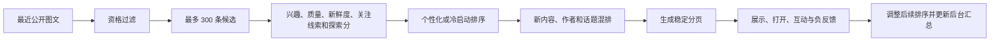

# 发现内容与搜索趋势

本文记录 Youni 当前已经实现的发现内容、推荐搜索、搜索汇总和后台分析方案。它以仓库中的实际行为为准，不描述尚未实现的远期设想。

## 核心决定

- 不直接采用 X 的推荐系统代码。Youni 只借鉴“候选筛选、综合排序、约束混排、反馈回流”的结构。
- 第一版使用可解释的轻量排序，不依赖模型训练、向量数据库、Cloudflare Vectorize 或外部推荐服务。
- 推荐搜索属于搜索业务，单独由 `searchDiscovery` 提供，和发现内容不是同一套概念。
- 搜索只保存按天汇总，不保存账号、匿名身份或单次搜索明细。

## 业务词汇

| 名称 | 含义 |
| --- | --- |
| 发现内容 | 发现页根据用户兴趣、内容质量、新鲜度和探索机会生成的图文列表 |
| 推荐搜索 | 搜索页根据最近 7 天全站趋势动态生成的关键词区域 |
| 搜索汇总 | 按上海日期和关键词直接累加的次数统计，不包含个人搜索记录 |
| 有效展示 | 图文卡片至少 50% 可见并持续 1 秒，只用于效果统计 |
| 已经看过 | 用户真正进入过图文详情，用于最近 7 天去重 |
| 不感兴趣 | 用户对单条图文的持续负反馈，可撤销 |
| 拉黑用户 | 单向隐藏对方内容并禁止双方私信，可在设置中解除 |

## 接口组织

图文、话题、用户资料和评论分别归入自己的业务分组。契约、服务端入口和客户端调用保持相同层级，不再把各组内容展开到根级。

| 业务 | 服务端路径 | 客户端调用前缀 |
| --- | --- | --- |
| 图文 | `/rpc/notes/*` | `client.notes` / `orpc.notes` |
| 话题 | `/rpc/topics/*` | `client.topics` / `orpc.topics` |
| 用户资料 | `/rpc/profiles/*` | `client.profiles` / `orpc.profiles` |
| 评论 | `/rpc/comments/*` | `client.comments` / `orpc.comments` |
| 推荐搜索与搜索汇总 | `/rpc/searchDiscovery/*` | `client.searchDiscovery` / `orpc.searchDiscovery` |
| 后台分析 | `/rpc/admin/*` | `client.admin` / `orpc.admin` |

当前主要地址：

| 地址 | 用途 |
| --- | --- |
| `/rpc/notes/feed` | 获取发现内容和继续加载 |
| `/rpc/notes/recordFeedEvents` | 批量记录发现反馈 |
| `/rpc/notes/setNoteNotInterested` | 设置或撤销“不感兴趣” |
| `/rpc/notes/searchNotes` | 搜索公开图文 |
| `/rpc/topics/searchTopics` | 搜索话题 |
| `/rpc/profiles/searchUsersPage` | 分页搜索用户 |
| `/rpc/profiles/setBlocked` | 拉黑或解除拉黑用户 |
| `/rpc/searchDiscovery/recommendations` | 获取推荐搜索词 |
| `/rpc/searchDiscovery/record` | 汇总一次真正提交的搜索 |
| `/rpc/admin/analytics` | 获取发现与搜索汇总 |
| `/rpc/admin/setSearchKeywordExcluded` | 停止或恢复趋势词推荐 |

根入口位于 [`packages/api/src/contracts/index.ts`](../packages/api/src/contracts/index.ts) 和 [`packages/api/src/routers/implementation.ts`](../packages/api/src/routers/implementation.ts)。其中明确注册 `notes`、`topics`、`profiles` 和 `comments` 四组，不再使用展开写法。

原来的 `/rpc/feed`、`/rpc/searchTopics`、`/rpc/searchUsers` 和 `/rpc/comments` 等根级地址已经失效。

## 发现内容流程



### 候选资格

每次主动刷新会新建一份发现清单。服务端先读取最多 300 条近期图文，再排除不合格内容。

候选必须满足：

- 已发布且公开；
- 作者账号正常、未封禁；
- 登录用户不会看到自己发布的内容；
- 排除当前用户拉黑的作者；
- 排除当前用户标记为“不感兴趣”的图文；
- 排除最近 7 天真正进入详情看过的图文。

卡片满足有效展示条件不代表用户已经看过。只有进入详情才会参与最近 7 天的看过内容去重。

游客没有账号级兴趣和负反馈。移动端只在本次运行中记住最多 200 条游客真正打开过的图文，刷新时尽量避免立刻重复；这些记录不会提交到服务端。

### 兴趣信号

登录用户的兴趣按图文话题计算，读取最近 30 天行为：

| 行为 | 权重 |
| --- | ---: |
| 收藏 | +5 |
| 点赞 | +3 |
| 打开详情 | +1 |
| 不感兴趣 | -4 |

一条图文有多个话题时，取这些话题的平均兴趣。所有话题权重绝对值之和达到 6，才启用个性化排序；信号不足时按冷启动处理，避免一两次操作过早固定用户兴趣。

### 排序信号

#### 兴趣 `I`

候选图文与用户近期话题兴趣的匹配程度，范围为 `-1` 至 `1`。只对兴趣信号足够的登录用户生效。

#### 内容质量 `Q`

```text
原始质量 = 点赞数 + 2 × 评论数 + 3 × 收藏数
质量分 Q = log(1 + 原始质量) / 当前候选中的最大值
```

对数处理会削弱极热门内容的数量优势。

#### 新鲜度 `F`

```text
F = 0.5 ^ (发布小时数 / 72)
```

图文发布 72 小时后新鲜度减半，之后继续平滑下降。

#### 关注线索 `S`

作者是当前用户关注的人时获得完整分数。否则根据当前用户所关注的人在最近 14 天对该图文的点赞和收藏计算，3 人互动时达到上限。

#### 探索 `E`

探索分根据本次浏览编号和图文编号稳定生成。它能让每次刷新出现不同组合，但不会在同一次翻页中突然改变顺序。

### 综合排序

兴趣信号足够的登录用户：

```text
总分 = 45% × I
     + 20% × Q
     + 15% × F
     + 15% × S
     +  5% × E
```

游客、新用户或兴趣不足的用户：

```text
总分 = 45% × Q
     + 35% × F
     + 20% × E
```

### 混排约束

排序完成后仍会逐条挑选，避免高分内容长期垄断页面。

- 候选充足时，每页至少 20% 是发布不超过 72 小时且最近 30 天有效展示不超过 5 次的新内容；
- 同一作者每页最多 2 条；
- 尽量避免同一主要话题连续出现 3 条；
- 新内容不足时不会为了凑比例而返回空位；
- 话题限制可以在候选不足时放宽，作者上限不放宽。

## 稳定翻页与刷新

第一次请求 `/rpc/notes/feed` 时，服务端会计算整次浏览的候选顺序和分页结果，再返回第一页与继续加载凭据。

继续加载凭据包含剩余页、当前位置和本次浏览编号，有效期 30 分钟，并经过服务端签名。客户端不能修改其中的顺序或位置。

因此：

- 同一次浏览继续加载不会重新排序；
- 已返回的图文不会在后续页重复；
- 下拉刷新会生成新的浏览编号和新组合；
- 刷新会先取回新第一页，再替换当前内容，不会先清空列表造成白色闪动；
- 已隐藏、作者异常、被拉黑或刚被标记为不感兴趣的图文，在返回前仍会再次过滤。

每条图文还会带一个有效期 24 小时的展示凭据，用来确认反馈来自服务端真实返回过的图文和位置。

## 发现反馈

登录用户的卡片至少 50% 可见并持续 1 秒，才算一次有效展示。移动端批量提交反馈，服务端校验展示凭据并防止同一反馈重复计数。

支持的反馈：

- 有效展示；
- 打开详情；
- 点赞；
- 收藏；
- 不感兴趣；
- 拉黑作者。

这些反馈的用途不同：

- 有效展示只用于效果统计和识别低曝光新内容；
- 打开详情才算真正看过，并用于最近 7 天去重；
- 打开、点赞、收藏和不感兴趣会影响话题兴趣；
- 拉黑作者会直接改变候选过滤；
- 反馈会同步增加按天汇总，后台只查看汇总，不展示个人明细。

长按发现页图文卡片会打开操作面板。用户可以点赞、收藏、关注或查看作者，也可以选择“不感兴趣”和“拉黑作者”。“不感兴趣”会立即隐藏并支持撤销；拉黑作者需要确认。

## 拉黑规则

拉黑是单向的：A 拉黑 B 后，A 看不到 B 的内容，B 仍能看到 A 的公开内容。双方不能继续私信。

设置页提供拉黑名单和解除入口。解除后只恢复正常可见性和私信资格，不自动建立关注关系。

## 异常降级

发现排序分两层降级：

1. 兴趣、关注线索或曝光统计读取失败时，继续使用冷启动排序；
2. 综合排序失败时，退回热门互动与新鲜度混排。

降级分数：

```text
3 × 点赞数 + 5 × 收藏数 + 2 × 评论数 + 72 小时内的新鲜度补分
```

降级结果仍保持同一作者每页最多 2 条。继续加载凭据过期或被篡改时，客户端需要刷新，不返回顺序不确定的内容。

## 推荐搜索

推荐搜索和本机搜索历史分开显示。本机历史只保存在当前设备；推荐搜索通过 `/rpc/searchDiscovery/recommendations` 动态获取，页面中不保留写死关键词。

推荐词生成规则：

1. 汇总最近 7 天全站搜索，并读取此前 7 天作为变化对照；
2. 最近 7 天至少被搜索 2 次，才进入趋势候选；
3. 管理员停止推荐的关键词会被排除；
4. 返回前再次确认关键词当前能搜到公开图文、正常用户或话题；
5. 趋势不足时，用最近 30 天公开图文中的活跃话题补位；
6. 最多返回 12 个词；没有任何可用词时返回空列表，移动端隐藏推荐区。

趋势排序会提高近期搜索和增长中关键词的权重，但不会改变现有的图文、用户和话题搜索匹配方式。

## 搜索汇总与隐私

只有用户真正提交搜索时，移动端才调用 `/rpc/searchDiscovery/record`。输入框变化、查看推荐词或只打开搜索页不会被统计。

关键词提交前会统一处理：

- 全角与半角形式；
- 英文字母大小写；
- 开头的话题符号；
- 首尾空格和连续空格；
- 空关键词和处理后超过 50 个字符的关键词会被忽略。

系统区分四种搜索入口：

- 自己输入；
- 本机历史；
- 推荐词；
- 外部跳转。

服务端直接累加“上海日期 + 关键词”对应的搜索总数、有结果次数和各入口次数。数据库不保存账号、匿名身份、单次搜索记录或请求地址。

搜索提交使用短时防刷限制，同一限流来源每分钟最多接受 30 次统计。限流只决定是否接受本次计数，不改变用户得到的搜索结果，也不会产生个人搜索明细。

## 后台分析

后台“推荐与搜索”页面提供：

- 发现页有效展示量、打开率、点赞收藏率、不感兴趣率和每日变化；
- 搜索总量、有结果数量、无结果关键词、各入口占比和关键词排行；
- 关键词与前一周期的搜索量对比；
- 最近 7 天、30 天、90 天和 90 天范围内的自选日期。

管理员和运营人员都能查看汇总。只有管理员可以停止或恢复趋势词的公开推荐。停止推荐只会把该词从推荐区移除，不会阻止用户主动搜索。

## 数据保留

| 数据 | 保留时间 | 是否关联个人 |
| --- | ---: | --- |
| 发现反馈明细 | 30 天 | 是，仅用于去重、兴趣调整和汇总校验 |
| 发现每日汇总 | 90 天 | 否 |
| 搜索每日汇总 | 90 天 | 否 |
| 不感兴趣偏好 | 撤销前持续保留 | 是 |
| 拉黑关系 | 解除前持续保留 | 是 |

清理任务每天运行一次。当前部署时间为 UTC 17:00，约为上海时间次日 01:00。搜索汇总日期统一按亚洲上海时间计算。

## 当前边界

- 兴趣只基于明确的话题，不理解正文语义或图片内容；
- 排序权重是固定规则，不会自动训练；
- 候选池最多覆盖 300 条近期合格图文；
- 没有相似用户、协同过滤、向量召回或在线实验；
- 实际搜索仍沿用现有匹配方式，没有引入新的全文搜索服务。

以后内容量和行为数据明显增长时，可以扩展候选召回和排序方式，但应保留现有业务接口、资格过滤、稳定分页、反馈凭据、隐私边界和客户端交互。

## 主要文件

| 位置 | 职责 |
| --- | --- |
| [`packages/api/src/contracts/index.ts`](../packages/api/src/contracts/index.ts) | 各业务接口的分组契约入口 |
| [`packages/api/src/routers/implementation.ts`](../packages/api/src/routers/implementation.ts) | 各业务接口的分组实现入口 |
| [`packages/api/src/routers/notes.ts`](../packages/api/src/routers/notes.ts) | 图文、发现列表和发现反馈入口 |
| [`packages/api/src/lib/note-feed.ts`](../packages/api/src/lib/note-feed.ts) | 候选过滤、信号读取、分页、反馈和降级 |
| [`packages/api/src/lib/note-feed-ranking.ts`](../packages/api/src/lib/note-feed-ranking.ts) | 个性化、冷启动、新内容和多样性混排 |
| [`packages/api/src/lib/note-feed-tokens.ts`](../packages/api/src/lib/note-feed-tokens.ts) | 翻页与展示凭据校验 |
| [`packages/api/src/routers/search-discovery.ts`](../packages/api/src/routers/search-discovery.ts) | 推荐搜索与真实搜索汇总入口 |
| [`packages/api/src/lib/search-analytics.ts`](../packages/api/src/lib/search-analytics.ts) | 关键词归一、趋势排序、上海日期和来源计数 |
| [`packages/api/src/lib/analytics-retention.ts`](../packages/api/src/lib/analytics-retention.ts) | 发现与搜索过期数据清理 |
| [`packages/db/src/schema/discovery.ts`](../packages/db/src/schema/discovery.ts) | 负反馈、发现反馈、每日汇总和趋势词控制数据 |
| [`apps/native/components/home/home-screen.tsx`](../apps/native/components/home/home-screen.tsx) | 发现页加载、刷新、反馈提交和即时隐藏 |
| [`apps/native/components/home/discover-note-actions-sheet.tsx`](../apps/native/components/home/discover-note-actions-sheet.tsx) | 长按图文后的操作面板 |
| [`apps/native/components/search/search-screen.tsx`](../apps/native/components/search/search-screen.tsx) | 推荐词、本机历史和真实搜索提交 |
| [`apps/web/src/routes/admin.analytics.tsx`](../apps/web/src/routes/admin.analytics.tsx) | 后台发现效果与搜索趋势页面 |
